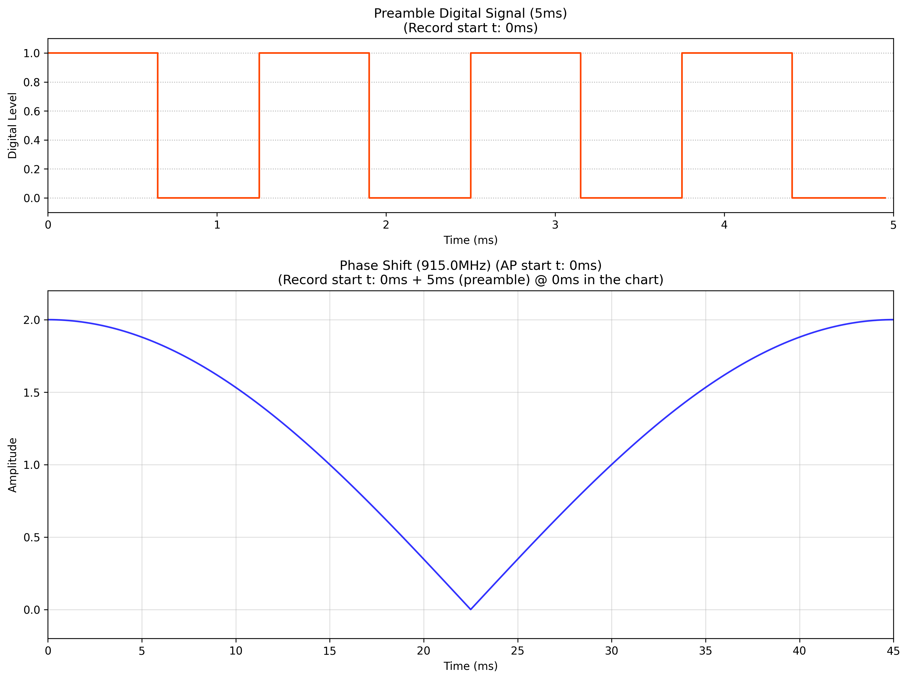
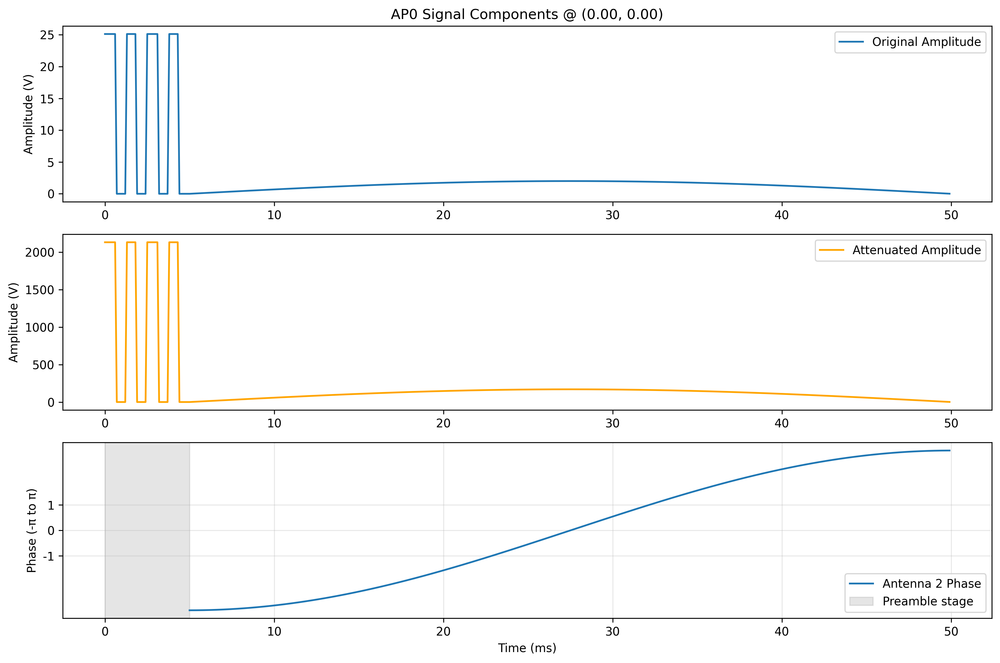
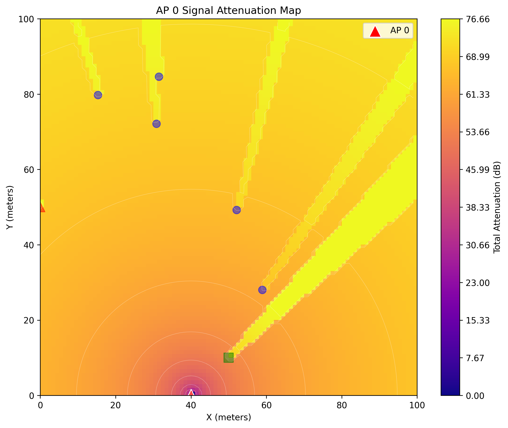
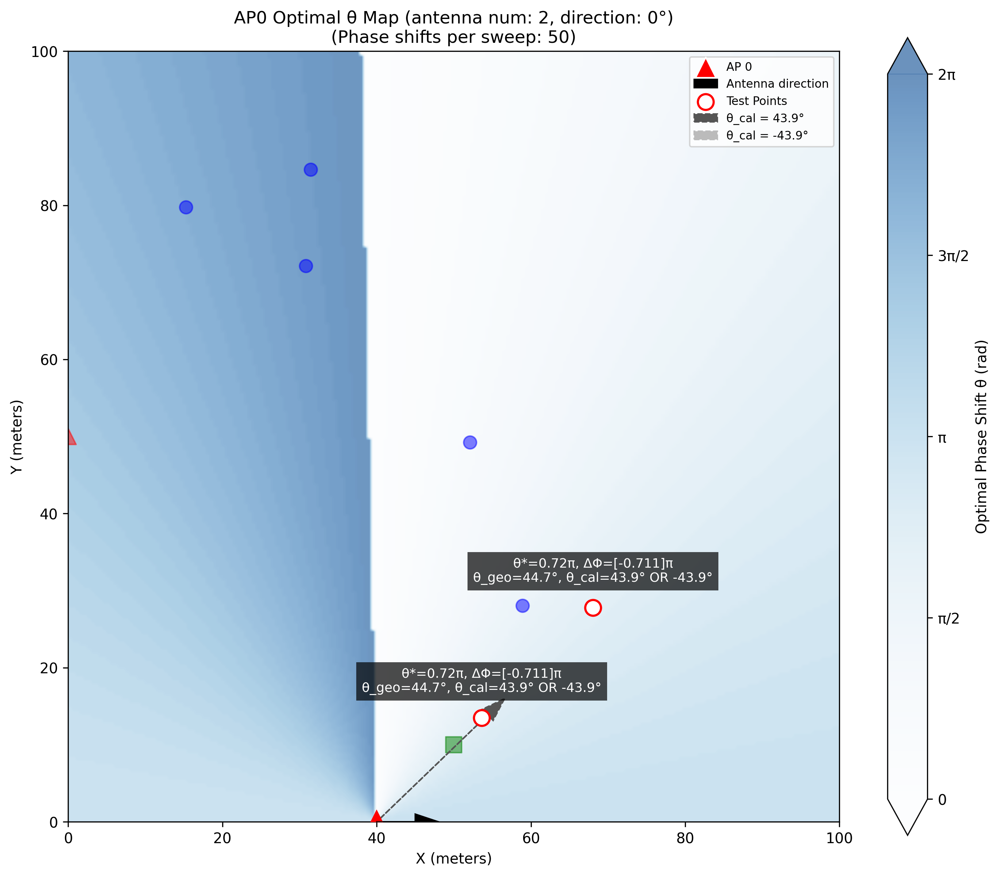
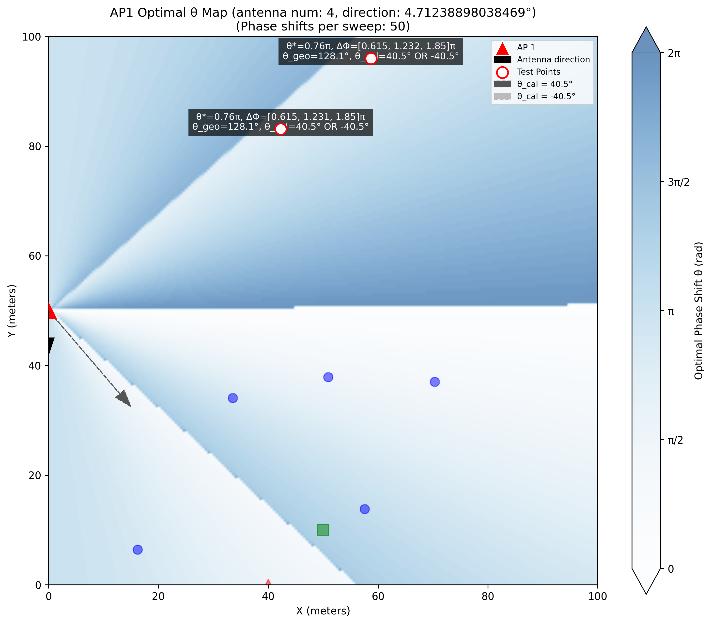
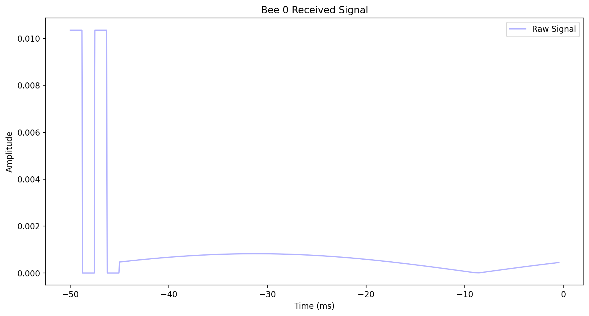
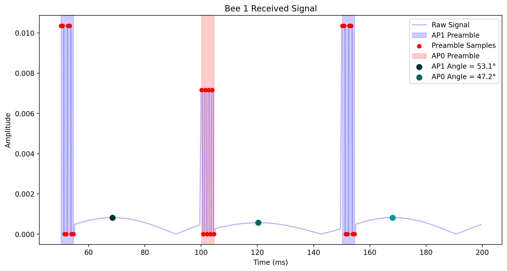
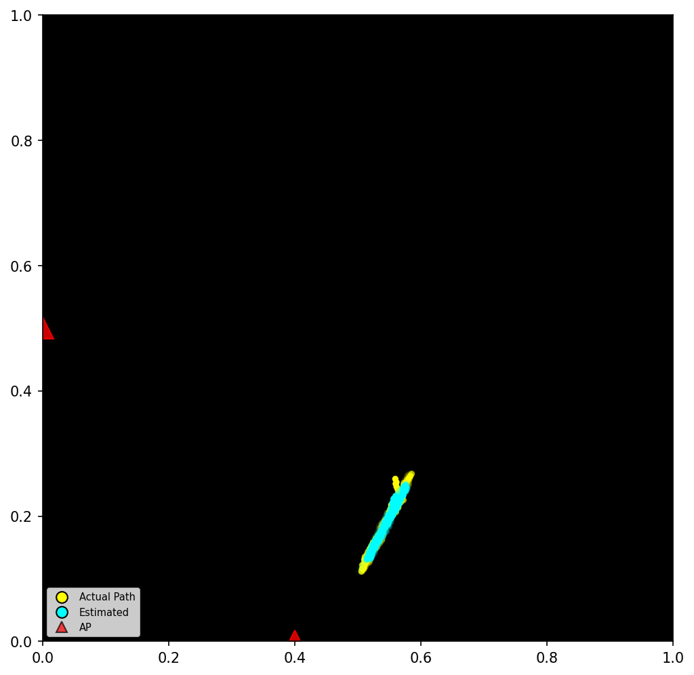
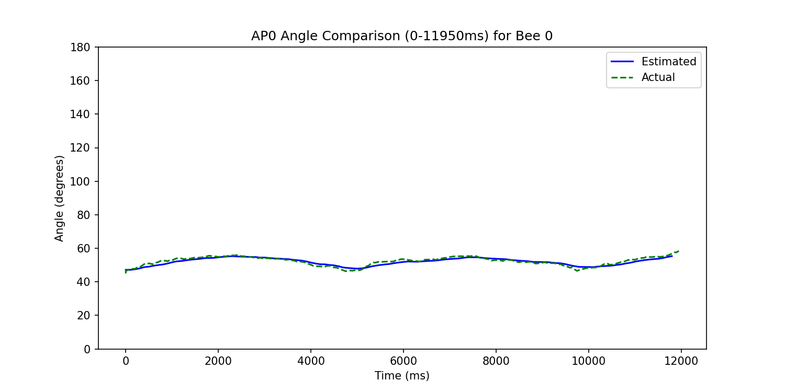

# Living IoT Simulator

## Introduction

This simulator implements a bio-inspired wireless localization system based on the "Living IoT" concept presented in the SIGCOMM'19 paper: ```Living IoT: A Flying Wireless Platform on Live Insects```. The system utilizes live insects (bumblebees) as mobile platforms carrying IoT devices, with multiple Access Points (APs) employing beamforming techniques for real-time positioning.

Key features of the simulator:

- **Insect Behavioral Modeling**: Simulates bee movement patterns including foraging behavior, nectar collection, and hive return logic

- **Beamforming Localization**: Implements TDMA-based phase sweeping with configurable parameters

- **Multi-AP Coordination**: Supports 2-antenna APs with directional beam patterns and phase difference calculations. In future, simulations with more antennas will be implemented.

- **Signal Propagation**: Models preamble detection and signal attenuation due to obstacles. Multi-path effects will be implemented in future.

- **Data Visualization**: Generates real-time trajectory plots and angle estimation comparisons. 

The system demonstrates how millimeter-scale backscatter devices mounted on insects can achieve: 

- Energy-efficient communication via beamformed signals

- Environmentally adaptive movement patterns

- Multi-AP collaborative positioning

Typical use cases include precision agriculture monitoring, search-and-rescue operations, and ecological research where GPS is unavailable or impractical. 

------

## Features

Sample figures generated by the simulator: 

- Access Point (AP) signal characteristics: 





- Access Point (AP) signal static attenuation map: 



- Access Point (AP) antenna beamforming best theta estimation pattern: 



Note that when there are more than 2 antennas deployed, there may be more than one possible direction with the same optimal theta sampled. For example, when there are 4 antennas deployed, the IoT platform failed to detect the AP orientation (thinking in AP's perspective): 



More efficient co-judgement algorithms will be implemented in the near future.

- Bee received raw signals and processed signals from APs: 





- Bee trajectory and estimated trajectory when there are 2 antennas deployed: 



- Bee angle estimation comparison between the proposed method and the ground truth in AP's perspective: 



- The overall virtual scene throughout the simulation: 


Besides the figures, several important simulation statistics are also generated with examples in .csv files, including: 

- Static, discretized AP NLOS calculation results

- Bee trails and estimated trails in AP's perspective

- The received raw signals from APs in Bee's perspective

## Quick Start

- Install the required packages: 

```bash
pip install -r requirements.txt
```

- Run the simulator: 

```bash
python simulator.py
```

------

## Future work 

- Add more simulation analysis and plots.

- Address the case where more than 2 antennas are deployed. 

- Add more noise effects and real-scenario modelling tests. 

- Implement Chapter 4.1: Self-Localization Accuracy

- Implement Chapter 3.2.2: Addressing Multi-path Effect

- Implement Chapter 3.3: Backscatter Communication Design

------

## Credits

- The simulator is developed by Kunhuan Wu (24137022g@connect.polyu.hk). Welcome to contact me for any questions and feedback! 

